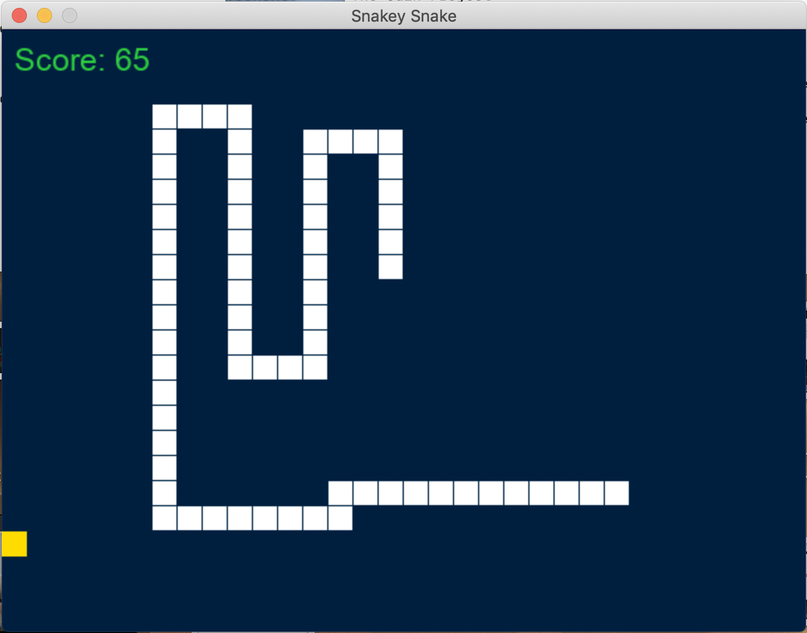
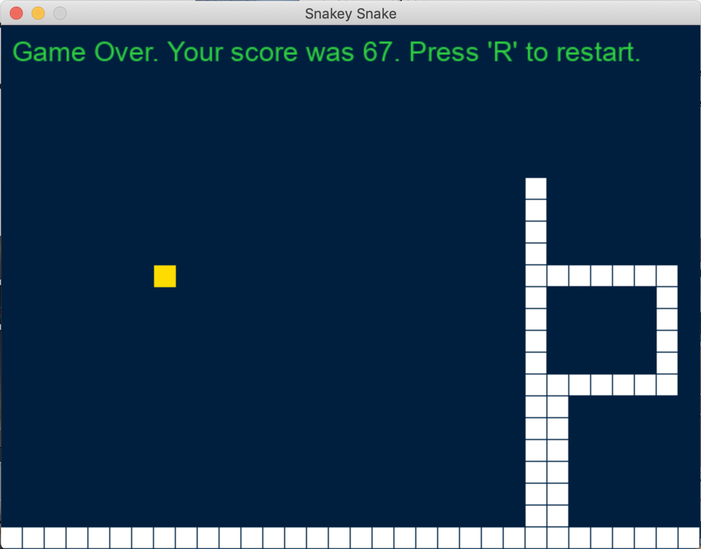

# Snakey Snake

**This project is a classic 'Snake'-style game built in Ruby using the ruby2d gem.**

**"Snakey Snake" is a very minimal version of the classic arcade game. In the game, you will:**

- Eat
- Grow
- Gain points
- Eventually bite your own tail.

## Built With

- Ruby
- ruby2d

## Live Demo

Due to the game's dependency on the ruby2d gem, a Live Demo is not possible at the moment.

## Getting Started

To get a local copy up and running follow these simple example steps.

### Prerequisites

The pre-requisites for playing this game include both **Ruby** and the **Ruby2d** gem.

[Install Ruby](https://www.ruby-lang.org/en/downloads/)

[Install ruby2d](http://www.ruby2d.com/learn/get-started/)

> If you have Ruby already installed, you just need to run the following code in the Terminal: gem install ruby2d

### Setup

Once the pre-requisites have been installed on your system, simply follow these instructions to clone the repository.

1. Open Terminal.

2. Navigate to your desired location for downloading the contents of this repository.

3. Copy and paste the following code into the Terminal:

    git clone https://github.com/Joseph-Burke/Snake

4. Hit enter.

5. Once the repository has been cloned, you can run "ruby snake.rb". The game window will appear and the game will begin. Enjoy!

👤 **Joe Burke**

- Github: [@Joseph-Burke](https://github.com/Joseph-Burke)
- Twitter: [@__joeburke](https://twitter.com/__joeburke)
- Linkedin: [Joseph Burke](https://www.linkedin.com/in/joseph-burke-b7a8261a5)

## 🤝 Contributing

Contributions, issues and feature requests are welcome!

Feel free to check the [issues page](https://github.com/Joseph-Burke/Snake/issues).

## Show your support

Give a ⭐️ if you like this project!

## Acknowledgments

- This project was built following a [YouTube tutorial](https://www.youtube.com/watch?v=2UVhYHBT_1o&t=1333s) from [Mario Visic](https://github.com/mariovisic).

## 📝 License

This project is [MIT](lic.url) licensed.

